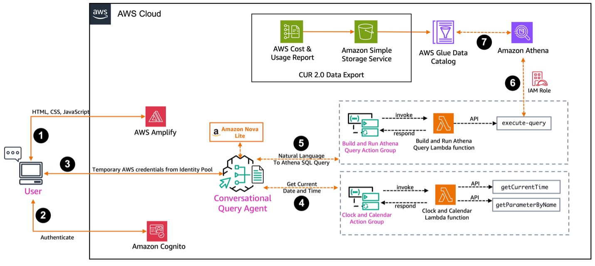
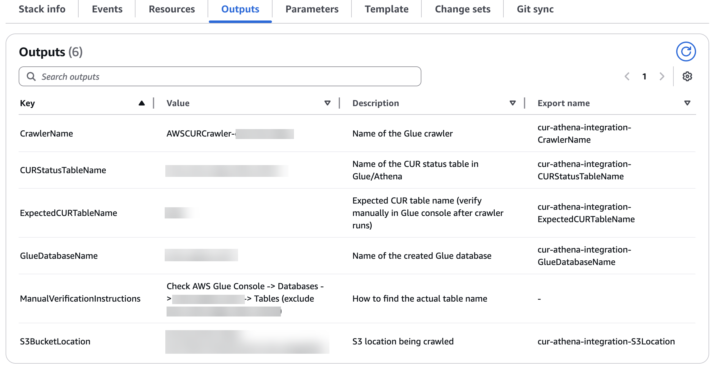
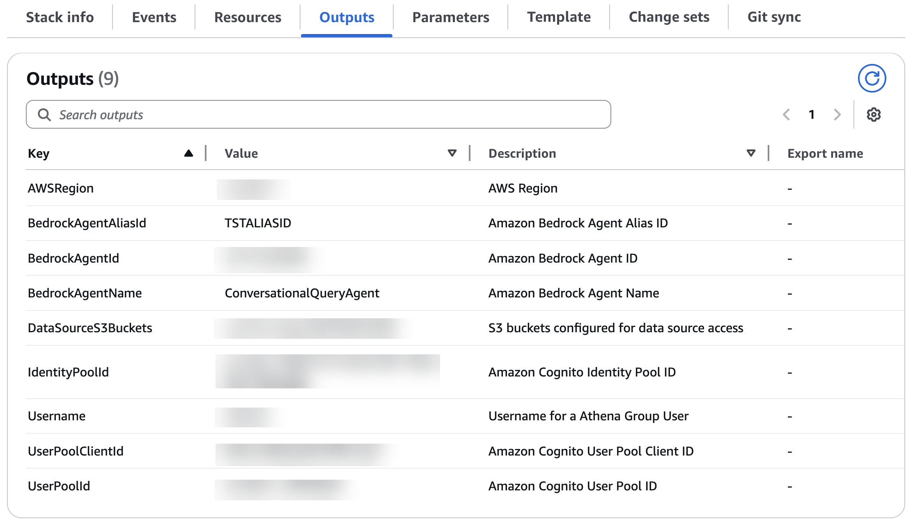
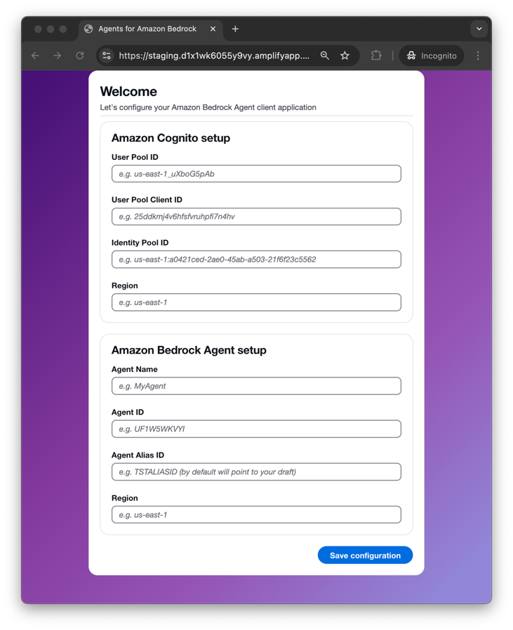
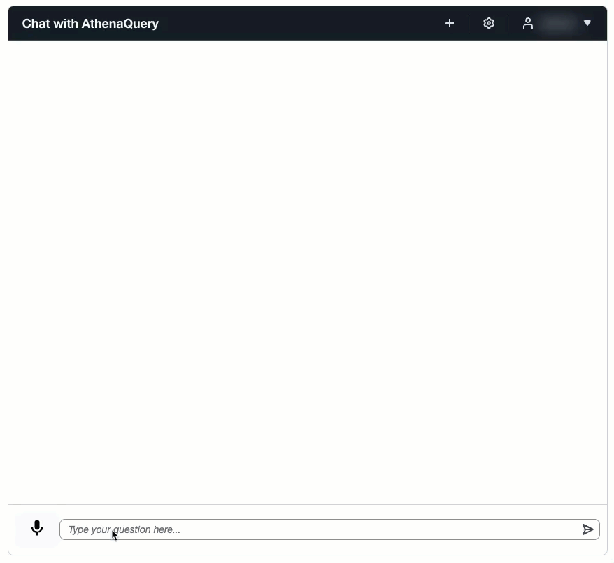

<!--
> [!NOTE]
> The content presented here serves as an example intended solely for educational objectives and should not be implemented in a live production environment without proper modifications and rigorous testing.
-->

# Build a Conversational Natural Language Interface for Amazon Athena Queries using Amazon Nova Model

## Table of Contents
- 📋 [Overview](#overview)
- 🏗️ [Solution overview](#solution-overview)
- ✅ [Prerequisites](#prerequisites)
- 🚀 [Deploy solution resources using AWS CloudFormation](#deploy-solution-resources-using-aws-cloudformation)
- ☁️ [AWS services in this solution](#aws-services-in-this-solution)
- 💰 [Cost](#cost)
- 🔒 [Security](#security)
- 🌎 [Supported AWS Regions](#supported-aws-regions)
- 💡 [Considerations](#considerations)
- 📝 [Conclusion](#conclusion)
- 📚 [Additional resources](#additional-resources)
- ➡️ [Next Steps](#next-steps)
- ❓ [FAQ, Known Issues, Additional Considerations, and Limitations](#faq-known-issues-additional-considerations-and-limitations)
- 📋 [Revisions](#revisions)
- ⚠️ [Notices](#notices)
- 👥 [Authors](#authors)
- 📜 [License](#license)

## Overview

Data analysis often presents significant challenges for business users who aren’t proficient in [SQL](https://aws.amazon.com/what-is/sql/). Traditional methods require technical expertise to query databases, leading to delayed insights and dependence on data teams. Many organizations struggle with making their data accessible to business users while maintaining the analytical capabilities of [Amazon Athena](https://aws.amazon.com/athena/).

Modern AI agents are transforming how businesses work with their data by creating natural conversations between people and machines. Instead of learning complex SQL commands, users can simply ask questions in plain English. [Amazon Bedrock Agents](https://aws.amazon.com/bedrock/agents/) makes this possible by using [foundation models](https://aws.amazon.com/what-is/foundation-models/) (FMs) that can understand human language, work with various data sources, and perform specific tasks automatically. With these tools, business users can get the answers they need directly from their data, without waiting for technical support.

Amazon Bedrock offers a range of FMs, each designed for specific use cases. Among these, [Amazon Nova](https://aws.amazon.com/ai/generative-ai/nova/) stands out as the next-generation FM from Amazon, delivering frontier intelligence and industry-leading price-performance. At its core, the Amazon Nova family consists of four distinct types of models, each serving unique business needs. The understanding models (available in Micro, Lite, Pro, and Premier variants) act as sophisticated interpreters of human language, with Amazon Nova Premier offering the most advanced capabilities for complex data analysis. Complementing these are the content generation models, [Amazon Nova Canvas](https://aws.amazon.com/ai/generative-ai/nova/creative/) and [Amazon Nova Reel](https://aws.amazon.com/ai/generative-ai/nova/creative/), which handle creative and content production tasks. There is also a speech-to-speech model, Amazon Nova Sonic. Lastly, the Amazon Nova family offers Amazon Nova Act, a model trained to perform actions in a web browser.

What makes Amazon Nova particularly powerful for our Athena query solution is its exceptional ability to handle complex reasoning tasks, generate precise text, and provide accurate summarizations. These capabilities are essential when translating natural language questions into SQL queries and explaining results back to users in clear, understandable terms.

The Amazon Nova family’s combination of sophisticated features and competitive pricing makes it an ideal choice for businesses looking to bridge the gap between technical data systems and non-technical users.

In this post, we explore an innovative solution that uses Amazon Bedrock Agents, powered by Amazon Nova Lite, to create a conversational interface for Athena queries. We use [AWS Cost and Usage Reports](https://docs.aws.amazon.com/cur/latest/userguide/what-is-cur.html) (AWS CUR) as an example, but this solution can be adapted for other databases you query using Athena. This approach democratizes data access while preserving the powerful analytical capabilities of Athena, so you can interact with your data using natural language.

## Solution overview

The architecture combines several AWS services to transform natural language questions into precise Athena queries for AWS CUR. Users can interact with their data using everyday language, automatically generating and executing appropriate SQL queries. Amazon Bedrock Agents, with Amazon Nova Lite as the FM, serves as the intelligent layer that maintains context throughout the conversation, handles query refinements, and facilitates accurate data retrieval. A key component of the solution is the conversational query agent – an Amazon Bedrock agent powered by Amazon Nova Lite that translates natural language into Athena SQL queries.

The agent integration with Athena supports seamless data exploration through natural conversations, with a streamlined architecture that supports efficient query processing. Other key features of the solution include:

* Secure user authentication through [Amazon Cognito](https://aws.amazon.com/cognito/) with [role-based access control](https://docs.aws.amazon.com/cognito/latest/developerguide/role-based-access-control.html)
* Frontend application hosted on [AWS Amplify](https://aws.amazon.com/amplify/)
* Real-time query processing and result visualization
* Natural language to SQL query transformation
* Context-aware conversation management

The architecture shown in the following diagram demonstrates how we’ve built a secure, scalable system for conversational data queries using several AWS services, including [AWS Lambda](https://aws.amazon.com/lambda/) functions.

*Figure 1. Reference Architecture of Conversational Natural Language Interface for Amazon Athena*

The workflow consists of the following steps:

1. Users interact with a web interface built using HTML, CSS, and JavaScript, hosted on Amplify.
2. Authentication is handled through Amazon Cognito, which verifies user identities and provides temporary AWS credentials from its identity pool.
3. After users are authenticated, they can send natural language queries through the interface.
4. Our conversational query agent, powered by Amazon Bedrock with Amazon Nova Lite, processes these queries with support from two key action groups:
   * A Clock and Calendar action group that provides temporal context.
   * A Build and Run Athena Query action group that handles query execution.
5. When a user submits a query, Amazon Nova Lite transforms it into SQL, which is then passed to the appropriate Lambda function.
6. The Lambda function, operating with the necessary [AWS Identity and Access Management](https://aws.amazon.com/iam/) (IAM) roles, executes the SQL query in Athena.
7. Athena processes the query against data cataloged in [AWS Glue](https://aws.amazon.com/glue), retrieving results that are then formatted and returned to the user through the same conversational interface.

This architecture provides secure, efficient query processing while maintaining a simple, conversation-like experience for users. The system scales automatically and maintains security through role-based access controls and secure credential management.

## Prerequisites

You must have the following in place to complete the solution in this post:

* An [AWS account](https://signin.aws.amazon.com/signin?redirect_uri=https%3A%2F%2Fportal.aws.amazon.com%2Fbilling%2Fsignup%2Fresume&amp;client_id=signup)
* FM [access](https://docs.aws.amazon.com/bedrock/latest/userguide/model-access.html) in Amazon Bedrock for Amazon Nova Lite in the same [AWS Region](https://docs.aws.amazon.com/glossary/latest/reference/glos-chap.html#region) where you will deploy this solution
* The accompanying [AWS CloudFormation](http://aws.amazon.com/cloudformation) template downloaded from the [aws-samples GitHub repo](https://github.com/aws-samples/sample-conversational-athena-query-agent)

Perform the following steps to set up AWS CUR 2.0 and Athena integration to AWS CUR 2.0 only if you haven’t completed this setup already. If you have the AWS CUR 2.0 set up and its integration with Athena, collect the database name and table name and proceed to the next section to deploy the solution.

* AWS CUR 2.0 set up:
  * [Create an AWS CUR 2.0 report](https://docs.aws.amazon.com/cur/latest/userguide/what-is-data-exports.html).
  * Wait for the first report to be delivered to your [Amazon Simple Storage Service](http://aws.amazon.com/s3) (Amazon S3) bucket. It can take up to 24 hours for AWS to deliver your first report.
* Athena integration to AWS CUR 2.0: The CloudFormation template [cur2-glue-athena-integration](https://github.com/aws-samples/sample-conversational-athena-query-agent/blob/main/deployment/cur2-glue-athena-integration.yml) is designed to automate the integration of AWS CUR 2.0 with Athena. The template includes an AWS   Glue crawler, an AWS Glue database, and a Lambda event. During the CloudFormation template deployment, specify the following required parameters:
  * `CURReportName` – Name of the AWS CUR 2.0 report created.
  * `S3BucketName` – Destination S3 bucket name for the AWS CUR 2.0 report.
  * `S3BucketPath` – Amazon S3 path of the bucket (`cur-report-path-prefix/cur-report-name/data`).

After the CloudFormation template deployment, copy the following from the Outputs tab on the AWS CloudFormation console to use during the deployment of next CloudFormation template as inputs:

* `GlueDatabaseName`
* `ExpectedCURTableName`

The following screenshot shows an example of the Outputs tab.

## Deploy solution resources using AWS CloudFormation

The CloudFormation template [conversational-query-agent](https://github.com/aws-samples/sample-conversational-athena-query-agent/blob/main/deployment/conversational-query-agent.yml) is designed to run in the us-east-1 Region. If you deploy in a different Region, you must configure cross-Region [inference profiles](https://docs.aws.amazon.com/bedrock/latest/userguide/inference-profiles-create.html) to have proper functionality and update the CloudFormation template accordingly.

During the CloudFormation template deployment, specify the following required parameters:

* Stack name
* Foundation model (`amazon.nova-lite-v1:0 or amazon.nova-v1:0`)
* Valid user email address
* Database name (`GlueDatabaseName` from the stack output)
* Table name (`ExpectedCURTableName` from the stack output)
* Data source S3 bucket name (AWS CUR 2.0 S3 bucket)
* Athena query results S3 bucket name (provide a new or existing S3 bucket name depending on if the parameter to create an Athena query results S3 bucket is `false` or `true`)
* Parameter to create an Athena query results S3 bucket (`true` or `false`)

AWS resource usage will incur costs. When deployment is complete, the following resources will be deployed:

* Amazon Cognito resources:
  * [User pool](https://docs.aws.amazon.com/cognito/latest/developerguide/cognito-user-pools.html) – `CognitoUserPoolforAthenaQueryApp`
  * [App client](https://docs.aws.amazon.com/cognito/latest/developerguide/user-pool-settings-client-apps.html) – `AthenaQueryApp`
  * [Identity pool](https://docs.aws.amazon.com/cognito/latest/developerguide/identity-pools.html) – `cognito-identity-pool-athenaquery`
  * [Groups](https://docs.aws.amazon.com/cognito/latest/developerguide/cognito-user-pools-user-groups.html) – `AthenaQuery`
  * [User](https://docs.aws.amazon.com/cognito/latest/developerguide/managing-users.html) – Athena Query User
* Lambda functions:
  * `BuildandRunAthenaQuery`
  * `ClockandCalendar`
* Amazon Bedrock agents:
  * `ConversationalQueryAgent` with action groups:
     * `BuildandRunAthenaQueryActionGroup`
     * `ClockandCalendarActionGroup`

After the CloudFormation template deployment, copy the following from the Outputs tab on the AWS CloudFormation console to use during the configuration of your application after it’s deployed in Amplify:

* `AWSRegion`
* `BedrockAgentAliasId`
* `BedrockAgentId`
* `BedrockAgentName`
* `DataSourceS3Buckets`
* `IdentityPoolId`
* `Username`
* `UserPoolClientId`
* `UserPoolId`

The following screenshot shows an example of the Outputs tab.

## Deploy the Amplify application

You must manually deploy the Amplify application using the frontend code found on GitHub. Complete the following steps:

* Download the frontend code `AWS-Amplify-Frontend.zip` from [GitHub](https://github.com/aws-samples/sample-conversational-athena-query-agent/tree/main/deployment).
* Use the .zip file to manually [deploy](https://docs.aws.amazon.com/amplify/latest/userguide/manual-deploys.html) the application in Amplify.
* Return to the Amplify console page and use the domain it automatically generated to access the application.

## Secure access with Amazon Cognito

The application’s security and access management are built on the Amazon Cognito authentication framework. Through the implementation of Amazon Cognito user pools, the system manages user authentication and group organization, and Amazon Cognito identity pools distribute temporary AWS credentials that align with designated IAM roles. This architecture makes sure the Amazon Bedrock Agents API and overall application remain accessible exclusively to authenticated team members, delivering strong security controls without compromising user experience.

## Amazon Bedrock Agents for conversational Athena queries

The Amazon Bedrock Agents architecture facilitates data analysis through natural language interactions with AWS CUR data stored in the [AWS Glue Data Catalog](https://docs.aws.amazon.com/prescriptive-guidance/latest/serverless-etl-aws-glue/aws-glue-data-catalog.html) and accessed using Athena. This agent uses Amazon’s FMs like Amazon Nova Lite to interpret complex cost analysis requests, transform them into precise SQL queries, and present results in a user-friendly format. The agent coordinates with specialized action groups: `ClockandCalendarActionGroup` for accurate date calculations and `BuildandRunAthenaQueryActionGroup` for executing optimized Athena queries against AWS CUR data. With comprehensive knowledge of AWS service naming conventions and AWS CUR schema details, the agent handles complex date ranges, cost calculations, and service-specific queries while maintaining security through Amazon Cognito authentication. This architecture demonstrates how Amazon Bedrock Agents can bridge the gap between natural language requests and technical database queries, helping users gain financial insights through simple conversations without needing SQL expertise or deep knowledge of the underlying data structure.

## Lambda functions for Amazon Bedrock action groups

As part of this solution, Lambda functions are deployed to support the action groups defined for the `ConversationalQueryAgent`. These functions enable the agent to perform complex queries on AWS CUR data and provide temporal context for accurate analysis.

The action group `ConversationalQueryAgent` uses two distinct Lambda backed action groups to deliver comprehensive cost analysis capabilities. The `ClockandCalendar` Lambda function provides current date and time functionality. This capability makes sure the agent has access to accurate temporal information, which is crucial for generating time-sensitive reports and aligning cost analyses with specific billing periods or custom timeframes.

The `BuildandRunAthenaQuery` Lambda function serves as the core for the agent’s analytical capabilities. This function connects directly with Athena to execute SQL queries against the AWS CUR data. For demonstration purposes, we use a database named `cid-cur` with a `data` table that contains the AWS CUR 2.0 information. The function processes these queries and returns formatted results that are straightforward to interpret and analyze.

## Amplify for frontend

Amplify provides a streamlined solution for deploying and hosting web applications with built-in security and scalability features. The service reduces the complexity of managing infrastructure, so developers can concentrate on application development. In our solution, we use the manual deployment capabilities of Amplify to host our frontend application code.

## Amazon Bedrock Agents testing
To validate the solution before using the Amplify deployed frontend, we can conduct testing directly on the Amazon Bedrock console. By navigating to the `ConversationalQueryAgent`, we can pose questions about cost analysis, such as “What are my Top 5 Services cost in each month of first quarter of 2025?” The `ConversationalQueryAgent` processes the request by first determining the correct time period through `ClockandCalendarActionGroup`, then constructs and executes appropriate SQL queries through `BuildandRunAthenaQueryActionGroup` to retrieve the requested cost information. The agent formats the response to provide the month-wise cost of the top 5 services in the first quarter of 2025.

After you set up the application in Amplify, navigate to the specified URL. When you access the application URL, you must provide Amazon Cognito and Amazon Bedrock Agents related details that facilitate secure user authentication and establish a connection between the frontend and the agent. This setup enables the application to manage user sessions and make authorized API calls to AWS services on behalf of the user.

You can enter information with the values you collected from the CloudFormation stack outputs. You will be required to enter the following fields, as shown in the following screenshot:

* User Pool ID
* User Pool Client ID
* Identity Pool ID
* Region
* Agent Name
* Agent ID
* Agent Alias ID
* Region
  

Sign in with your user name and password. A temporary password was automatically generated during deployment and sent to the email address you provided when launching the CloudFormation template. At first sign-in attempt, you will be asked to reset your password.

Now you can ask the same question in the frontend application, for example, “What are my Top 5 Services cost in each month of first quarter of 2025?” In a few seconds, the application will provide you detailed results for the question asked.

The following are a few additional sample queries to demonstrate the capabilities of this tool:

* What was my costliest Region in 2024?
* Out of all 4 quarters, which one was the costliest one in 2024?
* What is the cost of S3, VPC, and Guard duty in Q4 2024?

## AWS services in this solution

| AWS service | Description |
|-------------|-------------|
| [Amazon Athena](https://aws.amazon.com/athena/) | Core. Serverless interactive query service for analyzing data in Amazon S3 using SQL. |
| [Amazon Nova](https://aws.amazon.com/ai/generative-ai/nova/) | Core. AWS's next-generation foundation model for natural language understanding and SQL generation. |
| [Amazon Bedrock](https://aws.amazon.com/bedrock/) | Core. Provides access to Amazon Nova and other foundation models for natural language processing. |
| [AWS Lambda](https://aws.amazon.com/lambda/) | Core. Executes serverless functions for query processing and response generation. |
| [Amazon S3](https://aws.amazon.com/s3/) | Core. Stores the data that will be queried through Amazon Athena. |
| [Amazon Cognito](https://aws.amazon.com/cognito/) | Core. Provides user authentication and authorization for the web interface. |
| [AWS Amplify](https://aws.amazon.com/amplify/) | Core. Hosts the frontend web application for the conversational interface. |
| [AWS Identity and Access Management (IAM)](https://aws.amazon.com/iam/) | Supporting. Manages permissions and access control for AWS services used in the solution. |
| [AWS CloudFormation](http://aws.amazon.com/cloudformation) | Supporting. Deploys and configures the solution resources in a consistent and repeatable manner. |

## Cost

This estimate assumes moderate usage patterns with typical business analytics workloads. The majority of the cost comes from Amazon Athena query execution and Amazon Bedrock usage. Costs could increase with:

* Higher query frequency and complexity
* Larger datasets requiring more compute resources
* Increased token usage for complex natural language interactions
* Additional data storage in Amazon S3

| AWS Service | Usage Estimate | Monthly Cost (USD) |
|-------------|----------------|---------------------|
| Amazon Athena | 1TB data scanned per month | $5.00 |
| Amazon Bedrock (Nova) | 3,000 requests * 1,000 tokens/request | $30.00 |
| Amazon S3 | 100GB storage, 10GB data transfer | $7.50 |
| AWS Lambda | 5,000 invocations * 3 functions * 2s avg. duration | $0.00 (within free tier) |
| Amazon Cognito | 500 MAU | $0.00 (within free tier) |
| AWS Amplify | 5GB storage, 15GB data transfer | $0.75 |
| AWS IAM | N/A | $0.00 |
| Amazon CloudWatch | Basic monitoring + 1 GB logs | $0.50 |
| **Total Estimated Monthly Cost** | | **$43.75** |

## Security

When you build systems on AWS infrastructure, security responsibilities are shared between you and AWS. This [shared responsibility model](https://aws.amazon.com/compliance/shared-responsibility-model/) reduces your operational burden because AWS operates, manages, and controls the components including the host operating system, the virtualization layer, and the physical security of the facilities in which the services operate. For more information about AWS security, visit [AWS Cloud Security](http://aws.amazon.com/security/).

This solution implements the following security features:

- **Amazon Cognito user authentication** - Secure user authentication with user pools and identity pools
- **Role-based access control** - Ensures that only authorized users can access specific data and functionality
- **IAM roles and policies** - Provides least-privilege permissions for Lambda functions and other AWS services
- **Secure API communication** - All communication between components uses HTTPS encryption

## Supported AWS Regions

"Build a Conversational Natural Language Interface for Amazon Athena Queries using Amazon Nova Model" is supported in the following AWS Regions (as of July 2025):

| **Region Name** | |
|-----------|------------|
|US East (Ohio) | Asia Pacific (Seoul) |
|US East (N. Virginia) | Europe (Paris) |
|US West (Northern California) | Middle East (Bahrain) |
|US West (Oregon) | AWS GovCloud (US-West) |
|Africa (Cape Town) | Asia Pacific (Seoul) |

### Adapting the Solution for Other S3-Backed Athena Databases

While this solution is specifically designed for AWS Cost and Usage Report (CUR) 2.0 data, it can be easily adapted for any S3-backed Athena database by modifying key sections in the Amazon Bedrock agent instructions:

* Replace the entire "CUR Query Column List" section (which contains all the CUR-specific column definitions like bill_payer_account_id, line_item_unblended_cost, etc.) with your own table's column names and descriptions.

* Modify the "AWS Service Names" section to reflect the specific services or categories relevant to your data domain or remove it entirely if not applicable.

* Update the "Sample Query" section to demonstrate queries appropriate for your data structure and use cases.

* Adjust the "Cost Types" and "Amortized Cost Calculation" sections if your data doesn't involve financial calculations, replacing them with domain-specific calculation logic relevant to your dataset.

The core query construction principles, date handling, error prevention, and response formatting sections can remain largely unchanged as they provide universal best practices for Athena querying through conversational AI. 

### Clean up

If you decide to discontinue using the ConversationalQueryAgent application, you can follow these steps to remove it, its associated resources deployed using AWS CloudFormation, and the Amplify deployment:

1. **Delete the CloudFormation stack:**
   * On the AWS CloudFormation console, choose Stacks in the navigation pane.
   * Locate the stack you created during the deployment process (you assigned a name to it).
   * Select the stack and choose Delete.

2. **Delete the Amplify application and its resources.** For instructions, refer to [Clean Up Resources](https://aws.amazon.com/getting-started/hands-on/build-web-app-s3-lambda-api-gateway-dynamodb/module-six/).

## Considerations

For optimal performance, ensure your Amazon S3 data is properly partitioned and formatted (preferably in Parquet format) to minimize query costs and improve response times.

Consider implementing query result caching to reduce costs and improve response times for frequently asked questions.

Before deploying to production, enhance security by implementing additional safeguards such as query complexity limits and data access controls based on user roles.

Monitor Amazon Bedrock token usage to optimize costs, especially for complex natural language interactions that may require multiple model invocations.

## Conclusion

The integration of Amazon Nova with Amazon Athena demonstrates the transformative potential of conversational AI in data analytics. This solution bridges the gap between technical complexity and business user needs, enabling organizations to democratize data access while maintaining the power and scalability of AWS analytics services. By removing the barrier of SQL expertise, business users can now interact directly with their data using natural language, leading to faster insights and more data-driven decision making across the organization.

## Additional resources

To learn more about the technologies used in this solution, refer to the following resources:

* [Amazon Athena User Guide](https://docs.aws.amazon.com/athena/latest/ug/)
* [Amazon Nova Foundation Models](https://aws.amazon.com/ai/generative-ai/nova/)
* [Amazon Bedrock User Guide](https://docs.aws.amazon.com/bedrock/latest/userguide/)
* [Best Practices for Amazon Athena](https://docs.aws.amazon.com/athena/latest/ug/best-practices.html)
* [Introducing Amazon Nova foundation models: Frontier intelligence and industry leading price performance](https://aws.amazon.com/blogs/aws/introducing-amazon-nova-frontier-intelligence-and-industry-leading-price-performance/)

## Next Steps

To further enhance the solution's capabilities, consider implementing the following features:

* **Advanced Analytics Integration** – Connect with Amazon QuickSight for visual data representation
* **Multi-Database Support** – Extend the solution to work with other AWS data services like Amazon Redshift
* **Query Optimization** – Implement intelligent query optimization based on historical usage patterns
* **Voice Interface** – Add voice input capabilities using Amazon Transcribe
* **Automated Insights** – Integrate with Amazon Forecast for predictive analytics capabilities

## FAQ, Known Issues, Additional Considerations, and Limitations

**Frequently Asked Questions:**

Q: Can this solution work with existing Amazon Athena tables and databases?
A: Yes, the solution can be configured to work with your existing Athena catalogs, databases, and tables.

Q: What types of natural language questions are supported?
A: The solution supports a wide range of analytical questions including aggregations, filtering, grouping, and time-based queries.

**Known Issues:**
- Complex nested queries may require multiple iterations for optimal results
- Very large result sets may experience timeout issues

**Additional Considerations:**
- Amazon Bedrock requests are charged per token
- Amazon Athena charges are based on data scanned per query
- Consider implementing result caching for frequently asked questions

**Limitations:**
- Natural language processing accuracy depends on data schema complexity
- Some advanced SQL features may not be accessible through natural language
- Query performance is dependent on underlying data organization in S3

## Revisions

- **v1.0.0** – Initial release with Amazon Nova integration for conversational Amazon Athena queries

## Notices

Customers are responsible for making their own independent assessment of the information in this solution.

This solution:
(a) is for informational purposes only,
(b) represents AWS current product offerings and practices, which are subject to change without notice, and
(c) does not create any commitments or assurances from AWS and its affiliates, suppliers, or licensors.

AWS products or services are provided "as is" without warranties, representations, or conditions of any kind, whether express or implied.
AWS responsibilities and liabilities to its customers are controlled by AWS agreements, and this solution is not part of, nor does it modify, any agreement between AWS and its customers.

## Authors
- Ravi Kumar, Sr. TAM
- Salman Ahmed, Sr. TAM
- Sergio Barraza, Sr. TAM

## License

This library is licensed under the MIT-0 License. See the [LICENSE](./LICENSE) file.
