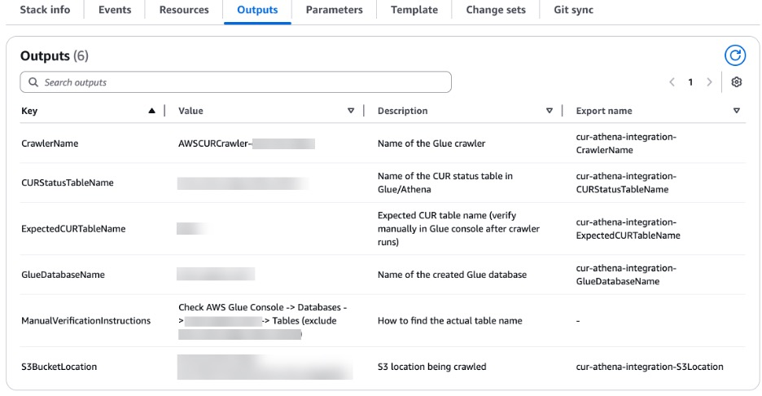
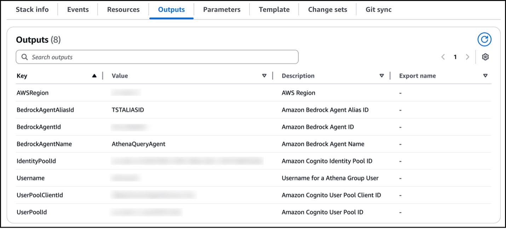

<!--
> [!NOTE]
> The content presented here serves as an example intended solely for educational objectives and should not be implemented in a live production environment without proper modifications and rigorous testing.
-->

# Build a Conversational Natural Language Interface for Amazon Athena Queries using Amazon Nova Model

## Table of Contents
- 📋 [Overview](#overview)
- 🏗️ [Solution overview](#solution-overview)
- ✅ [Prerequisites](#prerequisites)
- ☁️ [AWS services in this solution](#aws-services-in-this-solution)
- 💰 [Cost](#cost)
- 🔒 [Security](#security)
- 🌎 [Supported AWS Regions](#supported-aws-regions)
- 🚀 [Deploy the solution](#deploy-the-solution)
- 💡 [Considerations](#considerations)
- 📝 [Conclusion](#conclusion)
- 📚 [Additional resources](#additional-resources)
- ➡️ [Next Steps](#next-steps)
- ❓ [FAQ, Known Issues, Additional Considerations, and Limitations](#faq-known-issues-additional-considerations-and-limitations)
- 📋 [Revisions](#revisions)
- ⚠️ [Notices](#notices)
- 👥 [Authors](#authors)
- 📜 [License](#license)

## Overview

Data analytics has become increasingly critical for organizations to make informed business decisions. However, the complexity of SQL queries and the technical expertise required to interact with data warehouses often creates barriers for business users who need quick access to insights. [Amazon Athena](https://aws.amazon.com/athena/) provides a serverless, interactive query service that makes it easy to analyze data in Amazon S3 using standard SQL, but many business users still struggle with writing complex queries.

This solution demonstrates how to build a conversational natural language interface that allows users to interact with Amazon Athena using plain English questions. By leveraging the power of [Amazon Nova](https://aws.amazon.com/ai/generative-ai/nova/), AWS's next-generation foundation model, users can ask questions in natural language and receive both SQL queries and formatted results without needing to understand SQL syntax.

The Amazon Nova family comprises four types of models:

* Understanding models – Available in Micro, Lite, Pro, and Premier variants
* Content generation models – Featuring Canvas and Reel
* Speech-to-Speech models – Featuring Nova Sonic for real-time voice interaction capabilities
* Action models – Featuring Nova Act for autonomous task execution

These models are specifically optimized for enterprise and business applications, excelling in the following capabilities:

* Text generation
* Summarization
* Complex reasoning tasks
* Content creation
* Real-time voice interactions (Nova Sonic)
* Autonomous task execution (Nova Act)

This makes Amazon Nova ideal for building intelligent data interfaces that bridge the gap between business users and technical data systems.

A key advantage of the Amazon Nova model family is its [industry-leading price-performance ratio](https://aws.amazon.com/blogs/aws/introducing-amazon-nova-frontier-intelligence-and-industry-leading-price-performance/). Compared to other enterprise-grade AI models, Amazon Nova offers comparable or superior capabilities at a more competitive price point, making it an attractive choice for organizations looking to democratize data access.

## Solution overview

Our conversational natural language interface for Amazon Athena creates an intuitive bridge between business users and complex data analytics. The solution transforms natural language questions into SQL queries, executes them against Amazon Athena, and presents results in a user-friendly format.

The core architecture consists of several key components:

* **Natural Language Processing Agent** – Uses Amazon Nova to understand user intent, convert natural language questions into SQL queries, execute them via Amazon Athena, and format responses
* **Web Interface** – Provides a chat-like interface for users to interact with their data using natural language

Key features of the solution include:

* **Intuitive conversational interface** – Users can ask questions in plain English without SQL knowledge
* **Intelligent query generation** – Amazon Nova translates natural language into optimized SQL queries
* **Real-time data insights** – Immediate access to data stored in Amazon S3 through Amazon Athena
* **Context-aware responses** – The system maintains conversation context for follow-up questions
* **Secure data access** – Built-in authentication and authorization controls
* **Cost-effective analytics** – Serverless architecture that scales with usage

The architecture displayed in the following diagram uses several AWS services to create a scalable, secure, and efficient natural language data interface:

*Figure 1. Reference Architecture of Conversational Natural Language Interface for Amazon Athena*

<u>Architecture Workflow</u>:

1. The Administrator User deploys the solution to AWS Account and Region using an AWS CloudFormation Template.
The Base AWS CloudFormation stack will deploy and create all of the AWS resources needed to host the solution. This includes Amazon Cognito User group and user, Amazon Bedrock Agent, AWS Lambda Functions, AWS Identity and Access Management (IAM) roles and AWS STS token.
2. The user navigates to the Conversational Interface UI URL
3. Conversational Interface application is hosted on AWS Amplify
4. The web page is returned with HTML, CSS, JavaScript. User is now able to input the configuration details for Amazon Cognito and Amazon Bedrock Agent
5. Upon configuration completion, the user is prompted to authenticate using Amazon Cognito with a username and password configured for them in the user pool
6. After successful authentication, Cognito Identity Pool will negotiate temporary credentials from AWS Simple Token Service (STS)
7. Cognito Identity Pool passes temporary AWS credentials to the Conversational Interface UI
8. Once authenticated, the user now sees the Conversational Interface UI chat prompt to interact with the Amazon Bedrock Agent that is configured
9. The Natural Language Processing Agent evaluates each User's question and converts it into appropriate SQL queries for Amazon Athena
10. The agent reviews its predefined set of actions to identify the correct procedure for answering the user's question and generating the SQL query
11. The action groups execute their respective AWS Lambda functions to interact with Amazon Athena, executing the generated SQL queries against data stored in Amazon S3
12. The Natural Language Processing Agent compiles the query results and formats them into a natural language response, sending it back to the Conversational Interface UI visible to the User

In the following sections, we dive deeper into the architecture of our solution, explore the capabilities of the agent, and discuss the potential impact of this approach on data analytics strategies.

This approach democratizes data access by removing technical barriers while maintaining the power and flexibility of Amazon Athena for complex analytics workloads.

## AWS services in this solution

| AWS service | Description |
|-------------|-------------|
| [Amazon Athena](https://aws.amazon.com/athena/) | Core. Serverless interactive query service for analyzing data in Amazon S3 using SQL. |
| [Amazon Nova](https://aws.amazon.com/ai/generative-ai/nova/) | Core. AWS's next-generation foundation model for natural language understanding and SQL generation. |
| [Amazon Bedrock](https://aws.amazon.com/bedrock/) | Core. Provides access to Amazon Nova and other foundation models for natural language processing. |
| [AWS Lambda](https://aws.amazon.com/lambda/) | Core. Executes serverless functions for query processing and response generation. |
| [Amazon S3](https://aws.amazon.com/s3/) | Core. Stores the data that will be queried through Amazon Athena. |
| [Amazon Cognito](https://aws.amazon.com/cognito/) | Core. Provides user authentication and authorization for the web interface. |
| [AWS Amplify](https://aws.amazon.com/amplify/) | Core. Hosts the frontend web application for the conversational interface. |
| [AWS Identity and Access Management (IAM)](https://aws.amazon.com/iam/) | Supporting. Manages permissions and access control for AWS services used in the solution. |
| [AWS CloudFormation](http://aws.amazon.com/cloudformation) | Supporting. Deploys and configures the solution resources in a consistent and repeatable manner. |

## Cost

This estimate assumes moderate usage patterns with typical business analytics workloads. The majority of the cost comes from Amazon Athena query execution and Amazon Bedrock usage. Costs could increase with:

* Higher query frequency and complexity
* Larger datasets requiring more compute resources
* Increased token usage for complex natural language interactions
* Additional data storage in Amazon S3

| AWS Service | Usage Estimate | Monthly Cost (USD) |
|-------------|----------------|---------------------|
| Amazon Athena | 1TB data scanned per month | $5.00 |
| Amazon Bedrock (Nova) | 3,000 requests * 1,000 tokens/request | $30.00 |
| Amazon S3 | 100GB storage, 10GB data transfer | $7.50 |
| AWS Lambda | 5,000 invocations * 3 functions * 2s avg. duration | $0.00 (within free tier) |
| Amazon Cognito | 500 MAU | $0.00 (within free tier) |
| AWS Amplify | 5GB storage, 15GB data transfer | $0.75 |
| AWS IAM | N/A | $0.00 |
| Amazon CloudWatch | Basic monitoring + 1 GB logs | $0.50 |
| **Total Estimated Monthly Cost** | | **$43.75** |

## Security

When you build systems on AWS infrastructure, security responsibilities are shared between you and AWS. This [shared responsibility model](https://aws.amazon.com/compliance/shared-responsibility-model/) reduces your operational burden because AWS operates, manages, and controls the components including the host operating system, the virtualization layer, and the physical security of the facilities in which the services operate. For more information about AWS security, visit [AWS Cloud Security](http://aws.amazon.com/security/).

This solution implements the following security features:

- **Amazon Cognito user authentication** - Secure user authentication with user pools and identity pools
- **Role-based access control** - Ensures that only authorized users can access specific data and functionality
- **IAM roles and policies** - Provides least-privilege permissions for Lambda functions and other AWS services
- **Secure API communication** - All communication between components uses HTTPS encryption

## Supported AWS Regions

"Build a Conversational Natural Language Interface for Amazon Athena Queries using Amazon Nova Model" is supported in the following AWS Regions (as of July 2025):

| **Region Name** | |
|-----------|------------|
|US East (Ohio) | Asia Pacific (Seoul) |
|US East (N. Virginia) | Europe (Paris) |
|US West (Northern California) | Middle East (Bahrain) |
|US West (Oregon) | AWS GovCloud (US-West) |
|Africa (Cape Town) | Asia Pacific (Seoul) |

## Deploy the solution

### Prerequisites

You must have the following in place to complete the solution in this post:

* An [AWS account](https://signin.aws.amazon.com/signin?redirect_uri=https%3A%2F%2Fportal.aws.amazon.com%2Fbilling%2Fsignup%2Fresume&client_id=signup)
* Foundation model [access](https://docs.aws.amazon.com/bedrock/latest/userguide/model-access.html) in Amazon Bedrock for Amazon Nova Lite in the same [AWS Region](https://docs.aws.amazon.com/glossary/latest/reference/glos-chap.html#region) where you will deploy this solution
* The accompanying [AWS CloudFormation template](http://aws.amazon.com/cloudformation) downloaded from the aws-samples GitHub repo
* Perform the steps AWS CUR 2.0 Setup and Athena integration to CUR2.0 only if you do not have any previous CUR 2.0 already setup. If you have the CUR 2.0 setup and its integration with Athena, then get the Database name and Table name and proceed with the next section

### AWS CUR 2.0 set up

**[Create a CUR 2.0 report](https://docs.aws.amazon.com/cur/latest/userguide/what-is-data-exports.html):**
Wait for the first report to be delivered to your Amazon S3 bucket. It can take up to 24 hours for AWS to deliver your first report.

**Athena integration to CUR 2.0:**
The CloudFormation template [cur2-glue-athena-integration](deployment/cur2-glue-athena-integration.yml) is designed to automate the integration of CUR 2.0 report with Athena. The AWS CloudFormation template includes an AWS Glue crawler, an AWS Glue database, and an AWS Lambda event. During the CloudFormation template deployment, you will need to specify the following required parameters:

* CURReportName – Name of the CUR 2.0 report created
* S3BucketName – Destination S3 bucket name for CUR 2.0 report
* S3BucketPath – cur-report-path-prefix/cur-report-name/data

After the CloudFormation template deployment, copy the following from the Outputs tab on the AWS CloudFormation console to use during the deployment of next CloudFormation template as inputs:

* GlueDatabaseName
* ExpectedCURTableName

The following screenshot shows you what the Outputs tab will look like.

*Figure 2. Output of CloudFormation cur2-glue-athena-integration Template*

### Deploy solution resources using AWS CloudFormation

This CloudFormation template [conversational-query-agent](deployment/conversational-query-agent.yml) is designed to run in the us-east-1 Region. If you deploy in a different Region, you must configure cross-Region [inference profiles](https://docs.aws.amazon.com/bedrock/latest/userguide/inference-profiles-create.html) to have proper functionality and update the CloudFormation template accordingly.

During the CloudFormation template deployment, you will need to specify the following required parameters:

* Stack name
* Foundation Model (amazon.nova-lite-v1:0 or amazon.nova-v1:0)
* Valid user email address
* Database Name (GlueDatabaseName from above output)
* Table Name (ExpectedCURTableName from above output)
* Data Source S3 Bucket Name (CUR2.0 S3 Bucket)
* Athena Query Results S3 Bucket Name (provide a new/unique or existing S3 bucket name depending on 'Create Athena Query Results S3 Bucket' is false or true)
* Create Athena Query Results S3 Bucket (true/false)

AWS resource usage will incur costs. When deployment is complete, the following resources will be deployed:

**Amazon Cognito resources:**
* User pool – CognitoUserPoolforAthenaQueryApp
* App client – AthenaQueryApp
* Identity pool – cognito-identity-pool-athenaquery
* Groups – AthenaQuery
* User – Athena Query User

**Lambda functions:**
* BuildandRunAthenaQuery
* ClockandCalendar

**Amazon Bedrock agents:**
* ConversationalQueryAgent with action groups:
  * BuildandRunAthenaQueryActionGroup
  * ClockandCalendarActionGroup

After the CloudFormation template deployment, copy the following from the **Outputs** tab on the AWS CloudFormation console to use during the configuration of your application after it's deployed in Amplify:

* AWSRegion
* BedrockAgentAliasId
* BedrockAgentId
* BedrockAgentName
* IdentityPoolId
* UserPoolClientId
* UserPoolId

The following screenshot shows you what the Outputs tab will look like.

*Figure 3. Output of CloudFormation conversational-query-agent Template*

### Deploy the Amplify application

You need to manually deploy the Amplify application using the frontend code found on GitHub. Complete the following steps:

1. Download the frontend code AWS-Amplify-Frontend.zip from [GitHub](deployment/AWS-Amplify-Frontend.zip).
2. Use the .zip file to manually [deploy](https://docs.aws.amazon.com/amplify/latest/userguide/manual-deploys.html) the application in Amplify.
3. Return to the Amplify page and use the domain it automatically generated to access the application.

### Application Configuration and Usage

When you access the application URL, you will need to provide Amazon Cognito and Amazon Bedrock Agent related details which ensure secure user authentication and establish a connection between the frontend and the agent. This setup enables the application to manage user sessions and make authorized API calls to AWS services on behalf of the user.

You can enter information with the values you collected from the CloudFormation stack outputs. You will be required to enter the following fields:

* User Pool ID
* User Pool Client ID
* Identity Pool ID
* Region
* Agent Name
* Agent ID
* Agent Alias ID
* Region

You need to sign in with your username and password. A temporary password was automatically generated during deployment and sent to the email address you provided when launching the CloudFormation template. At first sign-in attempt, you will be asked to reset your password.

### Clean up

If you decide to discontinue using the ConversationalQueryAgent application, you can follow these steps to remove it, its associated resources deployed using AWS CloudFormation, and the Amplify deployment:

1. **Delete the CloudFormation stack:**
   * On the AWS CloudFormation console, choose Stacks in the navigation pane.
   * Locate the stack you created during the deployment process (you assigned a name to it).
   * Select the stack and choose Delete.

2. **Delete the Amplify application and its resources.** For instructions, refer to [Clean Up Resources](https://aws.amazon.com/getting-started/hands-on/build-web-app-s3-lambda-api-gateway-dynamodb/module-six/).

## Considerations

For optimal performance, ensure your Amazon S3 data is properly partitioned and formatted (preferably in Parquet format) to minimize query costs and improve response times.

Consider implementing query result caching to reduce costs and improve response times for frequently asked questions.

Before deploying to production, enhance security by implementing additional safeguards such as query complexity limits and data access controls based on user roles.

Monitor Amazon Bedrock token usage to optimize costs, especially for complex natural language interactions that may require multiple model invocations.

## Conclusion

The integration of Amazon Nova with Amazon Athena demonstrates the transformative potential of conversational AI in data analytics. This solution bridges the gap between technical complexity and business user needs, enabling organizations to democratize data access while maintaining the power and scalability of AWS analytics services. By removing the barrier of SQL expertise, business users can now interact directly with their data using natural language, leading to faster insights and more data-driven decision making across the organization.

## Additional resources

To learn more about the technologies used in this solution, refer to the following resources:

* [Amazon Athena User Guide](https://docs.aws.amazon.com/athena/latest/ug/)
* [Amazon Nova Foundation Models](https://aws.amazon.com/ai/generative-ai/nova/)
* [Amazon Bedrock User Guide](https://docs.aws.amazon.com/bedrock/latest/userguide/)
* [Best Practices for Amazon Athena](https://docs.aws.amazon.com/athena/latest/ug/best-practices.html)
* [Introducing Amazon Nova foundation models: Frontier intelligence and industry leading price performance](https://aws.amazon.com/blogs/aws/introducing-amazon-nova-frontier-intelligence-and-industry-leading-price-performance/)

## Next Steps

To further enhance the solution's capabilities, consider implementing the following features:

* **Advanced Analytics Integration** – Connect with Amazon QuickSight for visual data representation
* **Multi-Database Support** – Extend the solution to work with other AWS data services like Amazon Redshift
* **Query Optimization** – Implement intelligent query optimization based on historical usage patterns
* **Voice Interface** – Add voice input capabilities using Amazon Transcribe
* **Automated Insights** – Integrate with Amazon Forecast for predictive analytics capabilities

## FAQ, Known Issues, Additional Considerations, and Limitations

**Frequently Asked Questions:**

Q: Can this solution work with existing Amazon Athena tables and databases?
A: Yes, the solution can be configured to work with your existing Athena catalogs, databases, and tables.

Q: What types of natural language questions are supported?
A: The solution supports a wide range of analytical questions including aggregations, filtering, grouping, and time-based queries.

**Known Issues:**
- Complex nested queries may require multiple iterations for optimal results
- Very large result sets may experience timeout issues

**Additional Considerations:**
- Amazon Bedrock requests are charged per token
- Amazon Athena charges are based on data scanned per query
- Consider implementing result caching for frequently asked questions

**Limitations:**
- Natural language processing accuracy depends on data schema complexity
- Some advanced SQL features may not be accessible through natural language
- Query performance is dependent on underlying data organization in S3

## Revisions

- **v1.0.0** – Initial release with Amazon Nova integration for conversational Amazon Athena queries

## Notices

Customers are responsible for making their own independent assessment of the information in this solution.

This solution:
(a) is for informational purposes only,
(b) represents AWS current product offerings and practices, which are subject to change without notice, and
(c) does not create any commitments or assurances from AWS and its affiliates, suppliers, or licensors.

AWS products or services are provided "as is" without warranties, representations, or conditions of any kind, whether express or implied.
AWS responsibilities and liabilities to its customers are controlled by AWS agreements, and this solution is not part of, nor does it modify, any agreement between AWS and its customers.

## Authors
- Ravi Kumar, Sr. TAM
- Salman Ahmed, Sr. TAM
- Sergio Barraza, Sr. TAM

## License

This library is licensed under the MIT-0 License. See the [LICENSE](./LICENSE) file.
